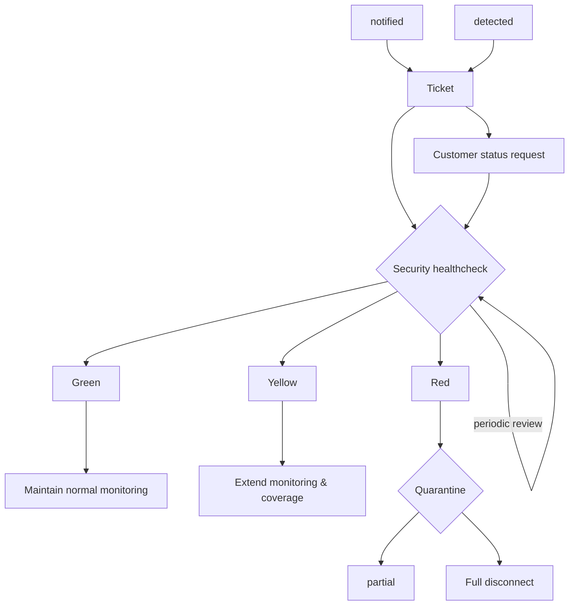

What to do if a customer or partner got compromised or infected.

## Course of Action

### Internal security healtcheck

* Ensure your own defense are current and up-to-date
* Ensure network boundaries are cleared and protected
  * over internet
  * over vpn or dedicated links
  * which ports and applications. some are more common for worms and ransomware than others.
* Ensure have validated backups, available failover and disaster recovery
* Does specific rules or regulations apply

### Customer/partner information

Ensure to have the right contacts both at IT and Security level to have confidence in available information.

* How critical is system
* Review malware, infection and propagation vectors
* What actions were done and what lessons learned
* Have an official "quarantine protocol" which is advertised to customers and partners and has upper management approval

Pay attention to contractual provisions especially if you want to fully shutdown service for some time.

### Workflow

* Partial: filter some ports and services
* Full disconnect: no connection, vpn, email, Internet...

## References

* [Spanish MSSP Targeted by BitPaymer Ransomware, Nov 2019](https://cybersecurityreviews.net/2019/11/08/spanish-mssp-targeted-by-bitpaymer-ransomware/)
* [Sodinokibi Ransomware Spreads Wide via Hacked MSPs, Sites, and Spam, Jun 2019](https://www.bleepingcomputer.com/news/security/sodinokibi-ransomware-spreads-wide-via-hacked-msps-sites-and-spam/)
* [Operation Cloud Hopper: What You Need to Know, Apr 2017](https://www.trendmicro.com/vinfo/us/security/news/cyber-attacks/operation-cloud-hopper-what-you-need-to-know)

* [APTs Targeting IT Service Provider Customers, US-CERT](https://www.us-cert.gov/APTs-Targeting-IT-Service-Provider-Customers)
