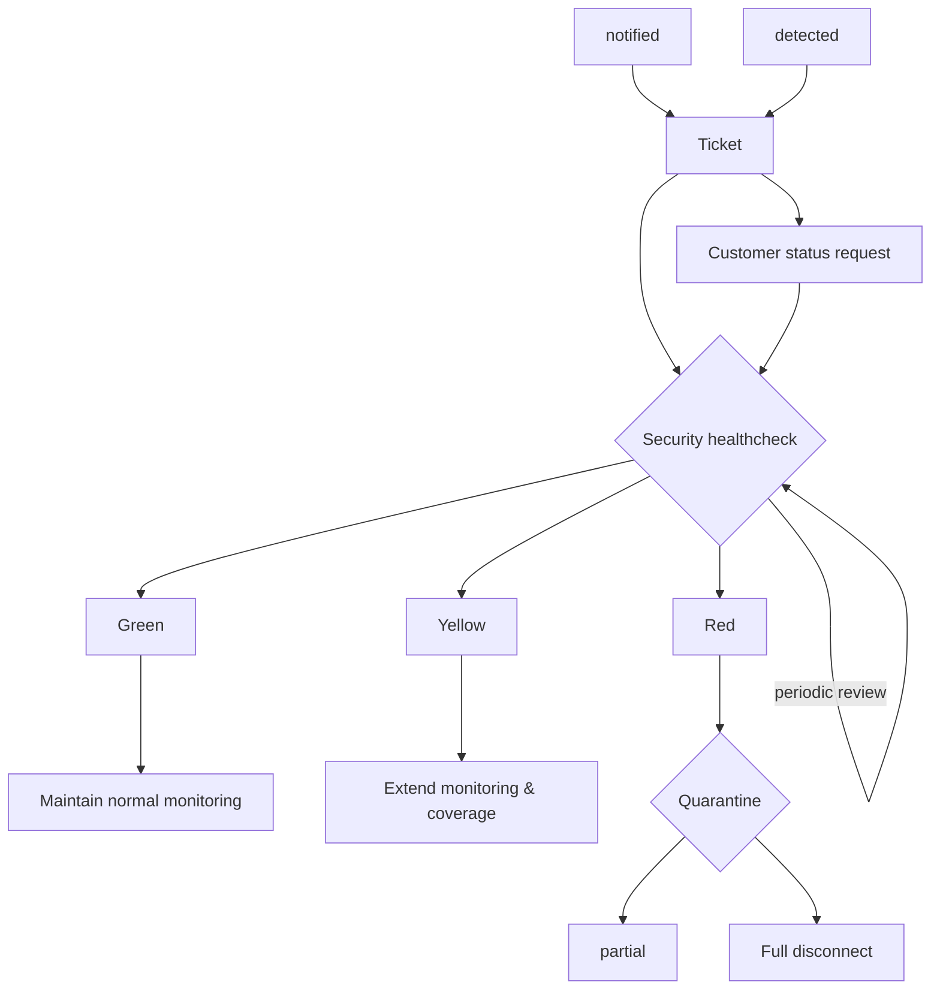

# Third party compromised (Supply chain)

What to do if a customer or partner got compromised or infected.

This can happen at various level
* Development supply chain
* Software provider (onprem or saas)
* Managed Service Provider (MSP)
* Hardware
* Merge & Acquisition (M&A)

## Course of Action

### Preparation

* Exhaustive inventory of software, libraries, suppliers, and customers
* Document associated risks and criticality level
* Contractual SLA
* Depending on sector and risks, regulator may require more than just contractual clauses and security questions aka audit
* Decide if can/should provide support during or after incident

### Internal security healtcheck

* Ensure your own defense are current and up-to-date
* Ensure network boundaries are cleared and protected
  * Over internet
  * Over vpn or dedicated links
  * Which ports and applications. some are more common for worms and ransomware than others.
* Ensure have validated backups, available failover and disaster recovery
* Does specific rules or regulations apply

### Customer/partner information

Ensure to have the right contacts both at IT and Security level to have confidence in available information.

* How critical is system
* Review malware, infection and propagation vectors
* What actions were done and what lessons learned
* Have an official "quarantine protocol" which is advertised to customers and partners and has upper management approval
  * Scope to define: vpn, web, email, chat, software onprem or saas...
* Decide unquarantine conditions (informal/formal statement of authoritative person, independent security firm statement, call...)

Pay attention to contractual provisions especially if you want to fully shutdown service for some time.

### Workflow

```mermaid
graph TD

A1[notified] --> B
A2[detected] --> B

B[Ticket] --> C1{Security healthcheck}
B --> C2[Customer status request]
C2 --> C1
C1 --> |periodic review| C1

C1 --> D1[Green]
C1 --> D2[Yellow]
C1 --> D3[Red]

D1 --> E1[Maintain normal monitoring]
D2 --> E2[Extend monitoring & coverage]
D3 --> E3{Quarantine}

E3 --> F1[partial]
E3 --> F2[Full disconnect]
```

* Partial: filter some ports and services
* Full disconnect: no connection, vpn, email, Internet...

## References

* [APTs Targeting IT Service Provider Customers, US-CERT](https://www.us-cert.gov/APTs-Targeting-IT-Service-Provider-Customers)
* [IRM-19-3rd-party_compromise](https://github.com/certsocietegenerale/IRM/blob/main/EN/IRM-19-3rd-party_compromise.pdf)
* [OWASP CICD-SEC-3: Dependency Chain Abuse](https://owasp.org/www-project-top-10-ci-cd-security-risks/CICD-SEC-03-Dependency-Chain-Abuse)
* [OWASP CICD-SEC-8: Ungoverned Usage of 3rd Party Services](https://owasp.org/www-project-top-10-ci-cd-security-risks/CICD-SEC-08-Ungoverned-Usage-of-3rd-Party-Services)
* [OWASP NHI3:2025 Vulnerable Third-Party NHI](https://owasp.org/www-project-non-human-identities-top-10/2025/3-vulnerable-third-party-nhi/)
* [MITRE ATT&CK T1195.001 Supply Chain Compromise: Compromise Software Dependencies and Development Tools](https://attack.mitre.org/techniques/T1195/001/)
* [MITRE ATT&CK T1195.002 Supply Chain Compromise: Compromise Software Supply Chain](https://attack.mitre.org/techniques/T1195/002/)

* [Spanish MSSP Targeted by BitPaymer Ransomware, Nov 2019](https://cybersecurityreviews.net/2019/11/08/spanish-mssp-targeted-by-bitpaymer-ransomware/)
* [Sodinokibi Ransomware Spreads Wide via Hacked MSPs, Sites, and Spam, Jun 2019](https://www.bleepingcomputer.com/news/security/sodinokibi-ransomware-spreads-wide-via-hacked-msps-sites-and-spam/)
* [Operation Cloud Hopper: What You Need to Know, Apr 2017](https://www.trendmicro.com/vinfo/us/security/news/cyber-attacks/operation-cloud-hopper-what-you-need-to-know)
* [Hotel chain discovers breach of customer database following acquisition of a competitor, Jul 2022](https://www.priv.gc.ca/en/opc-actions-and-decisions/investigations/investigations-into-businesses/2022/pipeda-2022-005/)
* SolarWinds
  * [#StopRansomware: CL0P Ransomware Gang Exploits CVE-2023-34362 MOVEit Vulnerability, Jun 2023](https://www.cisa.gov/news-events/cybersecurity-advisories/aa23-158a)
  * [MOVEit, the biggest hack of the year, by the numbers, Aug 2023](https://techcrunch.com/2023/08/25/moveit-mass-hack-by-the-numbers/)
* [Ontario and Alberta privacy commissioners release investigation findings into PowerSchool breach affecting school boards and other educational bodies, Nov 2025](https://www.ipc.on.ca/en/media-centre/news-releases/ontario-alberta-powerschool-breach)
* [Consequential amendments to Guidelines B-10 and B-13 related to foreign branches, Canada, Feb 2024](https://www.osfi-bsif.gc.ca/en/guidance/guidance-library/consequential-amendments-guidelines-b-10-b-13-related-foreign-branches) "the Office of the Superintendent of Financial Institutions (OSFI) is publishing changes to Guideline B-10: Third-Party Risk Management and Guideline B-13: Technology and Cyber Risk Management. These changes clarify how those guidelines apply to foreign bank branches and foreign insurance company branches."
* NPM
  * [The Shai-Hulud 2.0 npm worm: analysis, and what you need to know, Nov 2025](https://securitylabs.datadoghq.com/articles/shai-hulud-2.0-npm-worm/)
  * [Shai-Hulud 2.0: Guidance for detecting, investigating, and defending against the supply chain attack , Dec 2025](https://www.microsoft.com/en-us/security/blog/2025/12/09/shai-hulud-2-0-guidance-for-detecting-investigating-and-defending-against-the-supply-chain-attack/)
  * [The Hidden Blast Radius of the Axios Compromise, Apr 2026](https://socket.dev/blog/hidden-blast-radius-of-the-axios-compromise) "[...] The Hardest Part of Figuring Out If You Were Affected [...] The Core Problem: Time-Dependent Dependency Resolution"
  * [TanStack npm Packages Compromised in Ongoing Mini Shai-Hulud Supply-Chain Attack, May 2026](https://socket.dev/blog/tanstack-npm-packages-compromised-mini-shai-hulud-supply-chain-attack)
* [Clinejection — Compromising Cline's Production Releases just by Prompting an Issue Triager, Feb 2026](https://adnanthekhan.com/posts/clinejection/)
* Elastic's security team has released Supply Chain Monitor, an internal tool that monitors top npm and PyPI packages for supply chain compromises, a tool that also caught the recent Axios incident
  * <https://www.elastic.co/security-labs/how-we-caught-the-axios-supply-chain-attack>
  * <https://github.com/elastic/supply-chain-monitor>
  * <https://bsky.app/profile/campuscodi.risky.biz/post/3mir4ttwt5s2x>
* [CPUID got Compromised via Hijack ! Apr 2026](https://www.reddit.com/r/pcmasterrace/comments/1sh4zuk/cpuid_got_compromised_via_hijack/)
* [Lazarus Group Uses Git Hooks To Hide Malware, May 2026](https://opensourcemalware.com/blog/dprk-git-hooks-malware)
* [“Summary:
A compromised dependency in the JavaScript ecosystem led to credential theft, which enabled a supply chain attack on a Rust compression library, which was vendored into a Python build tool, which shipped malware to approximately 4 million developers before being inadvertently patched by an unrelated cryptocurrency mining worm.” https://cosocial.ca/@mhoye/116553395984214488](https://cosocial.ca/@timbray/116554174461548909), [Incident Report: CVE-2024-YIKES, Feb 2026](https://nesbitt.io/2026/02/03/incident-report-cve-2024-yikes.html)
* [GitHub confirms breach of 3,800 repos via malicious VSCode extension, May 2026](https://www.bleepingcomputer.com/news/security/github-confirms-breach-of-3-800-repos-via-malicious-vscode-extension/)
* [Cyberattaque : le sous-traitant au centre de la crise, Mai 2026](https://www.cnil.fr/fr/cyberattaque-le-sous-traitant-au-centre-de-la-crise)
* [Microsoft Store Apps May Deliver Go Backconnect Proxy Malware, May 2026](https://blog.lukeacha.com/2026/05/fake-windirstat-lightshot-apps-deliver.html)
* [Mini Shai-Hulud: Where SLSA’s Boundaries Fall, Jun 2026](https://openssf.org/blog/2026/06/10/mini-shai-hulud-where-slsas-boundaries-fall/)
* [Preliminary analysis of AUR malware, Jun 2026](https://ioctl.fail/preliminary-analysis-of-aur-malware/) (Archlinux packages with npm call added)
* [From package to postinstall payload: Inside the Mastra npm supply chain compromise by Sapphire Sleet, Jun 2026](https://www.microsoft.com/en-us/security/blog/2026/06/17/postinstall-payload-inside-mastra-npm-supply-chain-compromise/)
* [RFC 9943: An Architecture for Trustworthy and Transparent Digital Supply Chains](https://www.rfc-editor.org/info/rfc9943/), [Enhancing software supply chain security with Microsoft’s Signing Transparency, Nov 2025](https://azure.microsoft.com/en-us/blog/enhancing-software-supply-chain-security-with-microsofts-signing-transparency/), [RFC 9943: An Architecture for Trustworthy and Transparent Digital Supply Chains, Juil 2026](https://www.bortzmeyer.org/9943.html)

* Cooldown period
  * Dependabot [cooldown period](https://docs.github.com/en/code-security/reference/supply-chain-security/dependabot-options-reference#cooldown-)
  * Renovate [Minimum Release Age](https://docs.renovatebot.com/key-concepts/minimum-release-age/)
  * [pnpm 10.16 Adds New Setting for Delayed Dependency Updates, Sep 2025](https://socket.dev/blog/pnpm-10-16-adds-new-setting-for-delayed-dependency-updates) `minimumReleaseAge`
  * [We should all be using dependency cooldowns, Nov 2025](https://blog.yossarian.net/2025/11/21/We-should-all-be-using-dependency-cooldowns), [Dependency cooldowns, redux, Dec 2025](https://blog.yossarian.net/2025/12/13/cooldowns-redux)
  * [What's new in pip 26.0 - prerelease and upload-time filtering! Jan 2026](https://ichard26.github.io/blog/2026/01/whats-new-in-pip-26.0/) `--uploaded-prior-to`, [Support relative values/durations in --uploaded-prior-to](https://github.com/pypa/pip/pull/13837)
  * uv [exclude-newer](https://docs.astral.sh/uv/reference/settings/#exclude-newer)
  * [npm Introduces minimumReleaseAge and Bulk OIDC Configuration, Feb 2026](https://socket.dev/blog/npm-introduces-minimumreleaseage-and-bulk-oidc-configuration) `minimumReleaseAge`
  * [Cool down before you install: give new gems a few days to be vetted, Jun 2026](https://blog.rubygems.org/2026/06/03/cooldown-let-new-gems-be-vetted.html)
* Vendors:
  * CI/CD: aikido.dev, [Harden-Runner](https://docs.stepsecurity.io/harden-runner), snyk, socket.dev
  * Proxy: [DevGuard](https://docs.devguard.org/), Jfrog [Curation](https://jfrog.com/curation/), Veracode ([Package Firewall](https://www.veracode.com/products/veracode-package-firewall/))
  * General: Github, Gitlab, Sonatype
* Opensource:
  * CI/CD: [OWASP dependency-check](https://github.com/dependency-check/DependencyCheck)
  * Proxy: <https://github.com/ShieldForge/dependency-guardian>, [Introducing Socket Firewall: Free, Proactive Protection for Your Software Supply Chain, Sep 2025](https://socket.dev/blog/introducing-socket-firewall), <https://github.com/SocketDev/sfw-free>, [Introducing Supply-Chain Firewall: Protecting Developers from Malicious Open Source Packages, Dec 2024](https://securitylabs.datadoghq.com/articles/introducing-supply-chain-firewall/), <https://pypi.org/project/scfw/>, [Inline proxy for software package registries to provide observability and policy controls to installs.](https://github.com/thinkst/package-proxy) (Cloudflare worker)
  * [Awesome npm Security Best Practices](https://github.com/lirantal/npm-security-best-practices)

