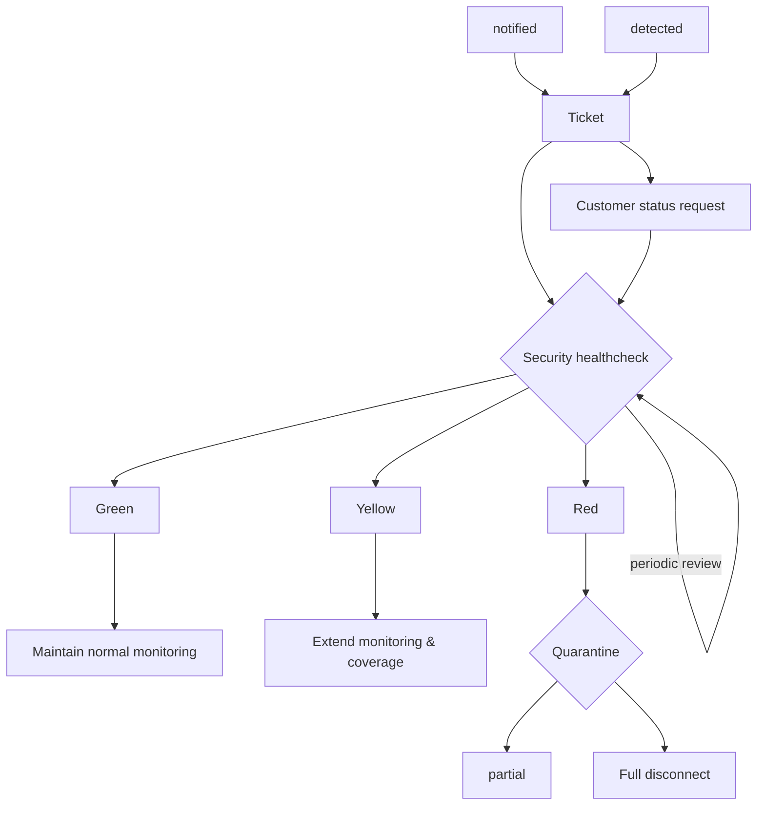

# Third party compromised (Supply chain)

What to do if a customer or partner got compromised or infected.

This can happen at various level
* Development supply chain
* Software provider (onprem or saas)
* Managed Service Provider (MSP)
* Hardware
* Merge & Acquisition (M&A)

## Course of Action

### Preparation

* Exhaustive inventory of software, libraries, suppliers, and customers
* Document associated risks and criticality level
* Contractual SLA
* Depending on sector and risks, regulator may require more than just contractual clauses and security questions aka audit
* Decide if can/should provide support during or after incident

### Internal security healtcheck

* Ensure your own defense are current and up-to-date
* Ensure network boundaries are cleared and protected
  * Over internet
  * Over vpn or dedicated links
  * Which ports and applications. some are more common for worms and ransomware than others.
* Ensure have validated backups, available failover and disaster recovery
* Does specific rules or regulations apply

### Customer/partner information

Ensure to have the right contacts both at IT and Security level to have confidence in available information.

* How critical is system
* Review malware, infection and propagation vectors
* What actions were done and what lessons learned
* Have an official "quarantine protocol" which is advertised to customers and partners and has upper management approval

Pay attention to contractual provisions especially if you want to fully shutdown service for some time.

### Workflow

```mermaid
graph TD

A1[notified] --> B
A2[detected] --> B

B[Ticket] --> C1{Security healthcheck}
B --> C2[Customer status request]
C2 --> C1
C1 --> |periodic review| C1

C1 --> D1[Green]
C1 --> D2[Yellow]
C1 --> D3[Red]

D1 --> E1[Maintain normal monitoring]
D2 --> E2[Extend monitoring & coverage]
D3 --> E3{Quarantine}

E3 --> F1[partial]
E3 --> F2[Full disconnect]
```

* Partial: filter some ports and services
* Full disconnect: no connection, vpn, email, Internet...

## References

* [APTs Targeting IT Service Provider Customers, US-CERT](https://www.us-cert.gov/APTs-Targeting-IT-Service-Provider-Customers)
* [IRM-19-3rd-party_compromise](https://github.com/certsocietegenerale/IRM/blob/main/EN/IRM-19-3rd-party_compromise.pdf)

* [Spanish MSSP Targeted by BitPaymer Ransomware, Nov 2019](https://cybersecurityreviews.net/2019/11/08/spanish-mssp-targeted-by-bitpaymer-ransomware/)
* [Sodinokibi Ransomware Spreads Wide via Hacked MSPs, Sites, and Spam, Jun 2019](https://www.bleepingcomputer.com/news/security/sodinokibi-ransomware-spreads-wide-via-hacked-msps-sites-and-spam/)
* [Operation Cloud Hopper: What You Need to Know, Apr 2017](https://www.trendmicro.com/vinfo/us/security/news/cyber-attacks/operation-cloud-hopper-what-you-need-to-know)
* [Hotel chain discovers breach of customer database following acquisition of a competitor, Jul 2022](https://www.priv.gc.ca/en/opc-actions-and-decisions/investigations/investigations-into-businesses/2022/pipeda-2022-005/)
* SolarWinds
  * [#StopRansomware: CL0P Ransomware Gang Exploits CVE-2023-34362 MOVEit Vulnerability, Jun 2023](https://www.cisa.gov/news-events/cybersecurity-advisories/aa23-158a)
  * [MOVEit, the biggest hack of the year, by the numbers, Aug 2023](https://techcrunch.com/2023/08/25/moveit-mass-hack-by-the-numbers/)
* [Ontario and Alberta privacy commissioners release investigation findings into PowerSchool breach affecting school boards and other educational bodies, Nov 2025](https://www.ipc.on.ca/en/media-centre/news-releases/ontario-alberta-powerschool-breach)
* [Consequential amendments to Guidelines B-10 and B-13 related to foreign branches, Canada, Feb 2024](https://www.osfi-bsif.gc.ca/en/guidance/guidance-library/consequential-amendments-guidelines-b-10-b-13-related-foreign-branches) "the Office of the Superintendent of Financial Institutions (OSFI) is publishing changes to Guideline B-10: Third-Party Risk Management and Guideline B-13: Technology and Cyber Risk Management. These changes clarify how those guidelines apply to foreign bank branches and foreign insurance company branches."
* NPM
  * [The Shai-Hulud 2.0 npm worm: analysis, and what you need to know, Nov 2025](https://securitylabs.datadoghq.com/articles/shai-hulud-2.0-npm-worm/)
  * [Shai-Hulud 2.0: Guidance for detecting, investigating, and defending against the supply chain attack , Dec 2025](https://www.microsoft.com/en-us/security/blog/2025/12/09/shai-hulud-2-0-guidance-for-detecting-investigating-and-defending-against-the-supply-chain-attack/)
  * [The Hidden Blast Radius of the Axios Compromise, Apr 2026](https://socket.dev/blog/hidden-blast-radius-of-the-axios-compromise) "[...] The Hardest Part of Figuring Out If You Were Affected [...] The Core Problem: Time-Dependent Dependency Resolution"
